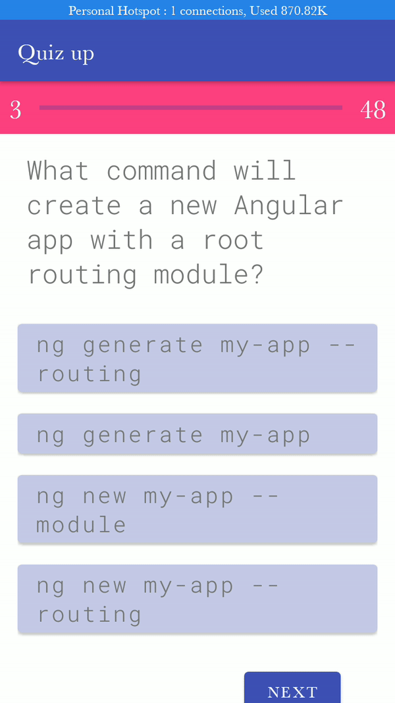

# Quiz-app
Android  Quiz app inspired by Pluralsight Skill IQ test.

## How it works
1. After opening the app, select the stack/technology which you want to test your skill.
2. Select the correct choice within the provided time span.
3. After a finishing a set of question, you are given your total score and the topics which you need to focus on to improve.
4. You can share your results via different apps such as gmail, whatsapp, twitter.

## Looks

> I developed the application 7 weeks into learning android development and therefore no guarantee that the best pracctices were used. However, I did my best to finish the application.

## Extras

> - Designed using a singleton design pattern.
> - Designed using material components.
> -  https://www.pluralsight.com/product/skill-i
